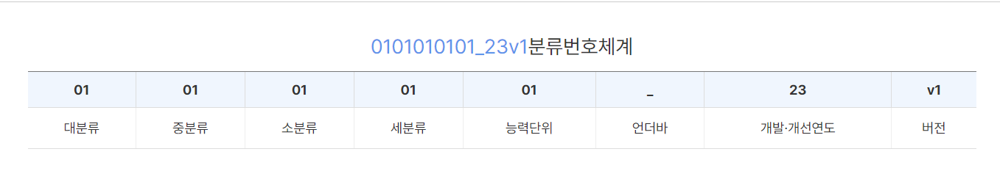

<NCS>

NCS번호는 위 사진과 같이 구성되어있으며, 우린 그 중 개발연도와 버전을 제외한 나머지 부분을 사용할 예정

<KECO>

##ncs-info.csv
- ncsClCd(NCS번호),compeUnitName(능력명),level(수준)으로 구성
- 수준은 산업현장 직무의 수준을 나타내며, 직업 추천 시 본인의 역량에 맞는 수준을 추천할 때 이용 가능할 수도 있을거라 판단하여 남겨둠. 자세한 내용은 [NCS구성](https://ncs.go.kr/th01/TH-102-001-03.scdo)참조
- 기존 데이터셋의 시간 컬럼은 활용 용도 및 판단 기준을 알수 없어서 제외

##Pre-processed-Job-Classification.csv
- KECO(KECO번호),subNum(세세분류),name(직업명)으로 구성
- KECO는 대분류, 중분류, 소분류, 세분류 로 총 4자리로 구성되어 있음
- 우리가 찾은 워크넷에서 제공하는 직업분류에는 세세분류 까지 총 5자리로 구성되어 있기 때문에 KECO 4자리와 세세분류 한자리를 구분하여 컬럼 형성함

##nsc-to-keco.csv
- ncsClCd(NCS번호),KECO(KECO번호),name(직업명)으로 구성
- 기존 데이터셋의 NCS에 대한 정보가 대분류, 중분류, 소분류, 세분류 만 있고 능력단위가 없어 데이터의 길이가 8임(기존은 10). 한가지 직업을 위해 여러가지 능력이 필요하다는 뜻이므로 추천을 위해 매칭할 때 묶어서 생각할 것.
